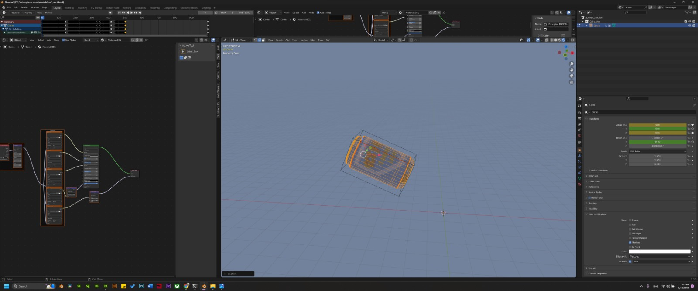

# EcoMind Documentation


| Table of Contents                                                     |
|-----------------------------------------------------------------------|
| [Introduction & Game Story](#introduction--game-story)                |
| [GamePlay, Installation & Controls](#gameplay-installation--controls) |
| [Code Part ](#code-part)                                              |
| - [Main Challenge 1: Movement](#main-challenge-1-movement)            |
| - [Main Challenge 2: BABYLON.GUI](#main-challenge-2-babylongui)       |
| - [Main Challenge 3: Underwater Scene](#main-challenge-3-underwater-scene) |
| - [Additional Important Details](#additional-important-details)       |
| [Design Part](#design-part)                                           |
| - [UI/UX](#ui-ux)                                                     |
| - [Modelling](#modelling)                                             |
| [Video Part ](#video-part)                                            |
| [Sound Effects & Music Part](#sound-effects--music-part)              |
| [Personal Opinion of Babylon.Js](#personal-opinion)                   |


## Introduction <a id="introduction--game-story"></a>
### General Introduction

Welcome to EcoMind, an underwater adventure designed to inspire environmental consciousness and ignite your passion for a greener future. Dive into the depths of the ocean and join the community of eco-warriors on a mission to save our precious marine ecosystem.

Equipped with your virtual diving gear, you'll embark on exciting expeditions to collect trash such as plastic bottles and cans that threaten the ocean. As time ticks away, you'll race against the clock to gather as much as possible to finish the mission.

As you progress, you'll unlock new equipment and face new challenges. Each Equipment locked is made of recycled plastic and cans that you are collecting from the water.

Ultimately, your goal in EcoMind is to complete all the missions and earn the prestigious EcoMind Trophy, symbolizing your readiness to make a lasting difference for a greener future and bring positive change to our planet.


### Team Member

- Samar Abi Khalil: MSc student for neuronal and cognitive systems in Université Côte d'Azur.

### Special Thanks

- Elie Ibrahim: 3D Artist and Animator who created all models, and helped with the UI/UX.
- Sassine Abi Khalil: Music Composer who created all music and sound effects.


## GamePlay, Installation & Controls <a id="gameplay-installation--controls"></a>

### GamePlay and controls

In EcoMind, I have designed a unique gameplay experience that goes beyond traditional keyboard controls. To provide a more immersive and intuitive gameplay, I have implemented mouse navigation as the primary method for exploring the underwater world and collecting trash.

#### Controls:

Mouse Movement: To navigate underwater and control your character, simply move your mouse in the desired direction. The movement of your mouse corresponds directly to the movement of your character in the game. Move the mouse up, down, left, or right to explore the depths of the ocean and search for trash to collect.

### Installation

1. Download the code and open `index.html` in your preferred web browser.

   or

2. If you prefer to run the game on a local server, or having issues with CORS, follow these steps:
   - Open a terminal and navigate to the game's directory.
   - Run the command: `python -m http.server`
   - Open your web browser and visit `http://localhost:8000`


## Code Part <a id="code-part"></a>

### First Weeks

At first, I started developing the game using Vue.js since most of the tutorials and resources I found were focused on Vue. However, I soon realized that I had to keep the size of the Git repository under 100MB. To meet this requirement, I made the decision to switch to a simpler approach using HTML, CSS, and JavaScript files.

### Main Challenge 1: Movement <a id="main-challenge-1-movement"></a>

The main challenge during the development process was to create smooth and responsive movement, as it is the foundation of the game experience. To find inspiration and guidance, I explored the code repository of a similar project called [Space Pirates](https://spacepirates.babylonjs.com/). Although the code was quite complex, I discovered that they used Quaternions for their movement implementation.

Based on this insight, I developed the movement for my game using the following code snippet:

```
const ball = MeshBuilder.CreateSphere("ball", { diameter: 1 });
ball.position = new Vector3(0, 1, 0);
ball.rotationQuaternion = new Quaternion();
let velocity = new Vector3(0, 0, 0.1); // initial velocity

this.scene.onBeforeRenderObservable.add(() => {
   if (!this.pause) {
       // update the sphere position every frame and always check collision for ground
       ball.moveWithCollisions(velocity);

       // update the velocity based on the rotation
       let direction = new Vector3(0, 0, 1);
       direction = direction.rotateByQuaternionToRef(<Quaternion>ball.rotationQuaternion, direction);
       velocity = direction.scale(0.1); // set the speed of movement
   }
});

document.addEventListener("mousemove", (event) => {
   // calculate the rotation quaternion based on mouse movement
   const rotationAxis = new Vector3(event.movementY, event.movementX, 0);
   const rotationQuaternion = Quaternion.RotationAxis(rotationAxis, Math.PI / 180);

   ball.rotationQuaternion = rotationQuaternion.multiply(ball.rotationQuaternion);
});
```

To enhance the camera movement, I initially used a FollowCamera but encountered issues with smoothness and ball movement and the rotationQuaternion wasn't working as expected. Seeking guidance, I consulted Mr. Michel Buffa, who provided helpful advice. He suggested using camera.getTarget(), normalizing it, and then moving the camera in that direction. I incorporated this approach into my code and created a bounding box to simplify movement, and it did really fix my issues. Here is the final code snippet for the movement:

```
function moveCharacter(){
    // 1 - let's compute the vector going from camera position to camera target
    const cameraFront = camera.getTarget().subtract(camera.position);
    cameraFront.normalize();
    frontVector = cameraFront;

    // 2 - compute rotation angles
    const dir = frontVector;
    const alpha = Math.atan2(dir.x, dir.z); // rotation around the Y-axis
    const beta = Math.asin(dir.y / dir.length()); // rotation around the X-axis

    // Set the rotation angles for the bounding box
    bounder.rotation.y = alpha;
    bounder.rotation.x =  - beta;

    // Update bounding box positions based on camera target
    const targetDirection = frontVector.scaleInPlace(0.1);

    // Compute the target position for the bounding box
    const targetPosition = bounder.position.add(targetDirection);

    // Move the bounding box with collisions
    bounder.moveWithCollisions(targetPosition.subtract(bounder.position).scale(mission.speed));

    // Adjust the camera position to be farther behind the bounding box and slightly up
    const cameraOffset = frontVector.scale(-100); // Increase the magnitude for a greater distance
    const cameraUpOffset = new BABYLON.Vector3(0, 1, 0); // Adjust the vertical offset as desired
    camera.position = bounder.position.add(cameraOffset).add(cameraUpOffset);

    // Update spotlight position but to only move on the xz plane
    light.position = new BABYLON.Vector3(bounder.position.x, light.position.y, bounder.position.z);

}

```

One final issue for the movement, was that since we were always moving, the axes placement was changing. So on Game over or Winner, I tried to do some movement in the camera with the function AnimateCamera(). However, sometimes it was moving in an unwanted movement, so I commented it. But you can see the code of the function in game.js.

### Main Challenge 2: BABYLON.GUI <a id="main-challenge-2-babylongui"></a>

During the development of EcoMind, one of the main challenges I encountered was implementing the user interface using BABYLON.GUI. As a web developer with a strong background in HTML and CSS, I initially created the interface using traditional web technologies. However, considering that the game is built on Babylon.js, I decided to leverage the power of BABYLON.GUI and dive deeper into the framework.

Adopting BABYLON.GUI introduced a new learning curve as I had to familiarize myself with its components and styling mechanisms. Creating the interfaces for EcoMind required careful and hard work.Additionally, integrating event listeners to handle user interactions with the interface proved to be a complex task.

I took guidance from the official Babylon.js documentation, specifically the BABYLON.GUI section available at [BABYLON GUI Documentation](https://doc.babylonjs.com/typedoc/modules/BABYLON.GUI). This resource provided valuable insights but I prefered if we can see an example of each component.

In the section "Personal Opinion of Babylon.Js", I list all the features that could need some improvements.

### Main Challenge 3: Underwater Scene <a id="main-challenge-3-underwater-scene"></a>

Creating a convincing underwater scene proved to be a significant challenge for me, and I saved it for the last. One of the main difficulties I encountered was the lack of comprehensive tutorials available for underwater scenes. Among the limited resources I found, the most helpful one was the Mystery Demo Tutorial Part, which was released three years ago and provided some guidance on creating underwater effects [Mystery Demo By Babylon.js](https://www.youtube.com/watch?v=JqMxTZ2q4Nw&list=PLsaE__vWcRam5eDcUlGHvylTaATXCAQnC).

I followed the steps outlined in the tutorial, and created my own shadow caustics and other necessary elements, But ended up using the one of the tutorial for better resolution. However, this is the snippet of My caustic Shadow : #QHB2ME#4 . A major issue I faced was that when the character moved it ended up in an endless fog. To address this problem, I decided to move the spotlight along with the character as they moved. This helped to create a more believable underwater experience.

Despite my efforts, I was unable to fully achieve the desired feeling of being underwater. The available water material only provided a surface-level representation, lacking the depth and immersion I was aiming for. I searched ways to create a more realistic underwater environment, but my search yielded no satisfactory results. It became clear that the challenge of capturing the true essence of being underwater remained unresolved, leaving room for further exploration and experimentation in the future.

P.S : The bottles, and cans underwater were given an animation to make the underwater scene feel more realistic.

### Additional Important Details <a id="additional-important-details"></a>

While creating the game, I focused on the flow of the game, and tried as much as I can to ensure a smooth flow without any mistakes.

For saving the states at my game I have the following variables added to the sessionStorage:
- Current_mission is used in case we want to replay a specific mission that we have already locked . It contains the id of the missions : 1,2,3,4,5,6.
- mission_completed is used to save the index of the highest mission completed.
- user_items is to check the unlocked prizes.
- high_score is to save the highest score of each session : {"1":10,"2":30, ...}.


After playing for many times, I noticed that  when I click on specific mission, and click continue, the user as always playing same mission, because on continue the current session wasn't updating, and then on play it was also stuck on the same level.                                                                                                                        
To fix it , I updated the current mission on each next. and when I press Play from the lobby I removed the current_session because this button should redirect to the highest mission completed.

Another detail that I focused on was the loader. Even after adding the promise to resolve when all meshes were imported, when the user was playing the game for the first time, the game was starting before the ground is fully loaded.
Consequently, I added the following condition to make sure that first time there is always more time for loader:

```
     if(mission.key === 1 && !sessionStorage.getItem('mission_completed'))
            minimumLoaderDuration = 4000;

```

## Design Part  <a id="design-part"></a>

With the help of Elie Ibrahim, a 3D artist and animator and also my partner in life and any project we develop, we created all our models from scratch, and we focused on the user interface and user experience. The Software used were Blender and Adobe Substance 3D.For the character animation we used Adobe Mixamo.

We really tried to take this competition to a higher level in focusing on all the designs. Even the loader, and the buttons. 

### UI/UX <a id="ui-ux"></a>
At the first step, our focus was to establish the main structure of our game, determining the necessary pages and interfaces. We started with initial designs and iterated towards the final versions. Below, you can see the progression from the early design concepts to the  final designs. These images showcase the evolution of our game's visual aesthetics and user interface, reflecting the dedication and effort put into creating an immersive and engaging experience

<div style="display: flex; justify-content: center;">
    
    
    
    
</div>

<div style="display: flex; justify-content: center;">
    
    
    
    
</div>

<div style="display: flex; justify-content: center;">
    
    
    
    
</div>


### Modelling <a id="modelling"></a>

A list of our 3D/2D Models made from scratch :
- Logo & Favicon
- 
- Loader
- 
- Buttons
- 
- Mask
- 
- Snorkel
- 
- Fin
- 
- Badges and Certificates
- 
  
  
  
- Plastic Bottle & Can
- 
  
- Character
- <div style="display: flex; justify-content: center;">
      
    
    
    
</div>


## Video Part <a id="video-part"></a>

All videos were made on daVinci Resolve Software. I recorded the audios and then changed the pitch on the software.
- [Trailer Video](https://www.youtube.com/watch?v=cJn66uCaL5Y) : showcase why I chose an underwater game.
- [GamePlay Video](https://www.youtube.com/watch?v=YJ1v2kh3qCM&t=12s) : showcase the features of the game, and how to play.


## Sound Effects & Music Part  <a id="sound-effects--music-part"></a>

With the help of Sassine Abi Khalil, a music composer and my brother, we created the following list of sound effects and music on Cubase Software:


- Lobby Background Music
- Game Background Music
- Count Down Sound Effect
- Game Over Sound Effect
- You got a point Sound Effect
- You won Sound Effect

## Personal Opinion <a id="personal-opinion"></a>

As a first-time participant in a game competition, I found the experience to be both exciting and challenging. Being primarily focused on website development, I was initially intrigued by the idea of creating a game within a website. This competition introduced me to Babylon.js, and I am delighted to have learned this powerful tool that I can now incorporate into my web projects to enhance user experiences.

During the development process, I encountered a few challenges and identified areas for improvement in Babylon.js. One aspect I found less intuitive was the GUI. While it offers a wide range of features, I felt that certain tasks, such as smoothly scaling a button on hover, required more lines of code compared to a simpler approach using SCSS. Additionally, I noticed a lack of comprehensive examples and up-to-date playgrounds covering all topics. It would be beneficial to have an extensive library of references and demos to explore and learn from.

Few Improvements for GUI:
- Hover effects
- Buttons should automatically have a pointer cursor
- Adding Margins could be useful to differ from padding
- Important Feature : Adding backgroundImage for buttons, rectangles ....
- Responsiveness 

On the positive side, I greatly appreciated the thorough documentation provided by Babylon.js. It is not merely a basic library but a rich ecosystem that incorporates concepts from Blender and Maya. Throughout my learning journey, I found the following links to be particularly helpful and enjoyable:
- [Node Editor](https://nme.babylonjs.com/)
- [Texture Tools : IBL](https://www.babylonjs.com/tools/ibl/)
- [Object Viewer : GLB](https://sandbox.babylonjs.com/)

In conclusion, I am delighted to have participated in this competition and discovered the capabilities of Babylon.js. Despite the challenges I encountered, I am excited to explore further and leverage this library's potential in my future web projects.

I have given all my dedication and passion for details for this little game, and I hope you will like it. 

P.S : The mission were simplified in order for the Jury to test the full game. However, the settings can be changed.
